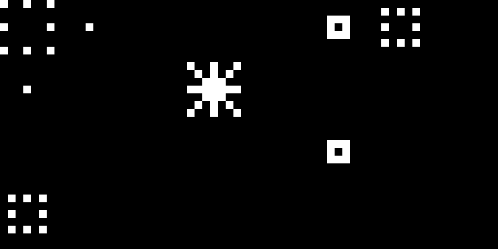
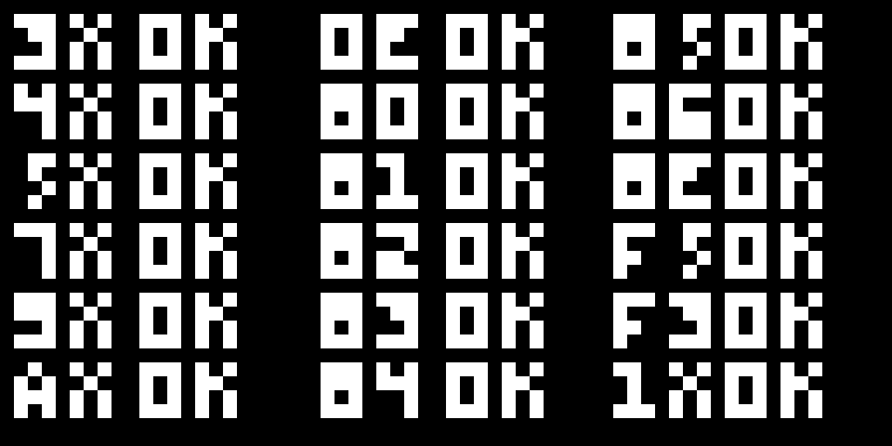

# Chip-8 Emulator 

A Chip-8 emulator in C++. 

<small>Output of [Stars by Sergey Naydenov](https://github.com/kripod/chip8-roms/blob/master/demos/Stars%20%5BSergey%20Naydenov%2C%202010%5D.ch8). </small>

<small>Results of a [test rom](https://github.com/corax89/chip8-test-rom). </small>
